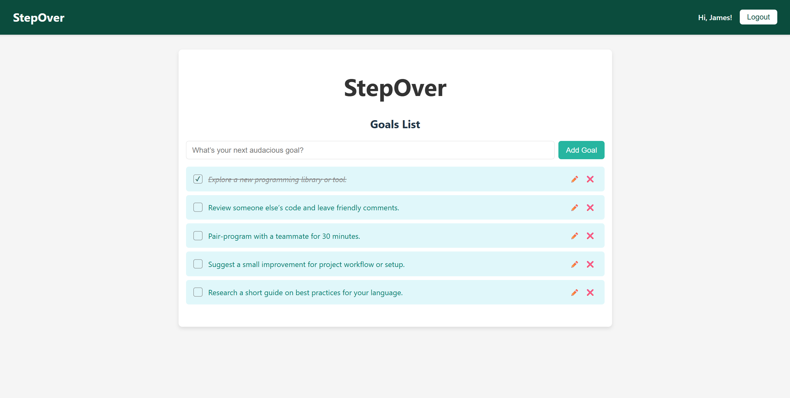

# StepOver App

A full-stack collaborative goal planner with role-based access.
The application allows multiple users to create, manage, and track shared goals, with permissions and responsibilities defined by user roles.
It helps the group stay aligned, visualize progress, and work toward common objectives.

Built with **ASP.NET Core** on the backend and **React + TypeScript** on the frontend.

---

## Preview



## Tech Stack

### Backend
- .NET 8
- ASP.NET Core Web API
- Entity Framework Core
- SQLite
- Swagger (OpenAPI)

### Frontend
- React
- TypeScript
- Vite

---

## Development Setup Only

### Backend Setup

1. Copy `appsettings.Development.json.example` to `appsettings.Development.json` and fill in your own admin credentials and JWT secret.  
JWT secret key should be sufficiently long. It is recommended to use at least 32 random characters (256 bits).
> ⚠️ Do **not** use these values in production.

Run backend

```bash
cd step-over-backend/GoalApi
dotnet restore
dotnet ef database update
dotnet run
```

---

### Frontend Setup

2. Copy `env.example` to `env.development`
> ⚠️ Do **not** use these values in production.

Run frontend

```bash
cd step-over-frontend/goal-frontend
npm install
npm run dev
```

---

Log in with the dev admin using the credentials you provide in `appsettings.Development.json`.
